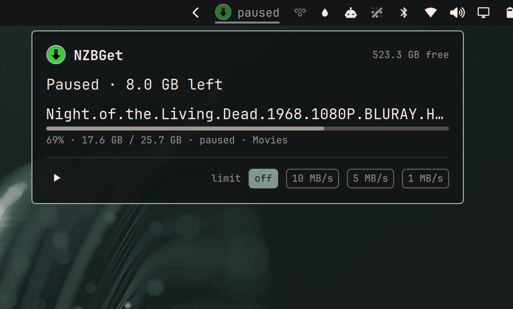

# NZBGet Queue

Omarchy bar widget showing NZBGet's live download speed, with the queue,
pause/resume and a speed limit in the popup.

Hidden entirely while nothing is downloading.



## Install

```bash
omarchy plugin add https://github.com/Kyrunner/omarchy-nzbget-queue.git --enable
```

## Setup

Create `~/.config/omarchy-nzbget/config.json`:

```json
{
  "url": "http://192.168.1.10:6789",
  "user": "nzbget-control-username",
  "password": "nzbget-control-password"
}
```

`chmod 600` it — those credentials can pause and reconfigure your downloader.

The username and password are NZBGet's **Settings → Security →
ControlUsername / ControlPassword**, sent as HTTP Basic auth. NZBGet ships with
defaults (`nzbget` / `tegbzn6789`); if yours still accepts them, change them
before exposing this or anything else to your network.

## Using it

| | |
|---|---|
| Bar | NZBGet mark with the current rate, e.g. `↓ 12.4 MB/s`. Hidden when idle. |
| Bar, `paused` | Mark dimmed, with the word — you paused it, nothing is broken |
| Bar, `processing` | Downloading finished; NZBGet is unpacking or repairing |
| Bar, red `!` | Something is wrong; the popup names it |
| Click | Show the queue |
| ⏸ / ▶ | Pause or resume all downloading |
| `off` `10` `5` `1 MB/s` | Speed limit presets |
| `Space` in popup | Pause / resume |
| Middle-click | Refresh now |
| `r` in popup | Refresh now |
| `Esc` | Close |

## What it shows, and what it refuses to invent

Each queued item gets a progress bar, percentage, transferred and total size, and
its state in plain words — NZBGet's raw `LOADING_PARS` and `VERIFYING_REPAIRED`
say nothing useful to someone watching a download, so they read as `checking` and
`verifying repair`.

**ETA only appears where it means something.** NZBGet reports sizes, not
estimates, so the ETA is computed from the current rate. That makes it honest for
the item actually downloading and meaningless for anything queued behind it —
which would have to guess at everything ahead of it — so queued items simply have
no ETA rather than a confident-looking fiction.

For the same reason, a paused queue shows no ETA at all, and post-processing
shows `processing` rather than `↓ 0 B/s`, which reads as broken when NZBGet is in
fact busy unpacking.

## Polling

3s while something is downloading, backing off to 15s when the queue is empty.
A speed readout needs a few seconds to feel live, but an idle NZBGet does not
deserve a wakeup every 3s on a laptop.

The queue itself is only fetched when `status` says there is one, so an idle
poll is a single small request.

## Dependencies

| | |
|---|---|
| NZBGet | Developed against **26.2**. Uses only the standard JSON-RPC API. |
| `bash`, `python3` | Standard library only — nothing to `pip install`. |

The bar icon is an SVG, needing `qt6-svg` — already a hard dependency of
`quickshell`.

## Removing it

```bash
omarchy plugin remove ky.nzbget-queue
rm -rf ~/.config/omarchy-nzbget
```

The plugin writes nothing outside its own config, which it only ever reads.
There is no state directory and no cache.

## Debugging

`backend.sh` is the whole network surface, so it can be run over SSH:

```bash
./backend.sh                 # rate, queue and disk, as JSON
./backend.sh pause
./backend.sh resume
./backend.sh limit 5120      # KB/s; 0 = unlimited
```

Failures are distinct on purpose — `not configured`, `bad config`,
`auth failed`, `unreachable`, `http <code>` — because a dead downloader and an
idle one must never look the same.

## Design

See [DESIGN.md](DESIGN.md) for why the formatting lives in Python rather than
QML, and why the bar item is built from a Row instead of the usual bar button.

## Icons

`nzbget.svg` is from [dashboard-icons](https://github.com/homarr-labs/dashboard-icons)
(Apache 2.0) — the same source as the author's other Omarchy plugins.

## Preview image

`preview.png` is a real session with the release name replaced by
*Night of the Living Dead* (1968), which is public domain in the US — its
original release prints omitted the copyright notice. Every other value in it
(speed, progress, sizes, free space) is unaltered.
